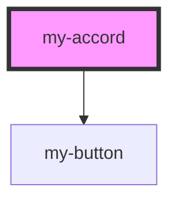

# my-accord

<!-- Auto Generated Below -->

## Properties

| Property      | Attribute      | Description | Type      | Default     |
| ------------- | -------------- | ----------- | --------- | ----------- |
| `check`       | `check`        |             | `boolean` | `undefined` |
| `isopen`      | `isopen`       |             | `boolean` | `undefined` |
| `titelAccord` | `titel-accord` |             | `string`  | `"ACHTUNG"` |

## Events

| Event        | Description | Type                  |
| ------------ | ----------- | --------------------- |
| `openaccord` |             | `CustomEvent<string>` |

## Dependencies

### Depends on

- [my-button](../my-button)

### Graph

----------------------------------------------

*Built with [StencilJS](https://stenciljs.com/)*
