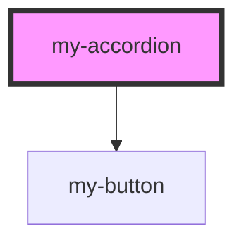

# my-accordion

<!-- Auto Generated Below -->

## Properties

| Property     | Attribute     | Description | Type      | Default     |
| ------------ | ------------- | ----------- | --------- | ----------- |
| `accordText` | `accord-text` |             | `string`  | `undefined` |
| `isOpen`     | `is-open`     |             | `boolean` | `undefined` |

## Dependencies

### Depends on

- [my-button](../my-button)

### Graph

----------------------------------------------

*Built with [StencilJS](https://stenciljs.com/)*
