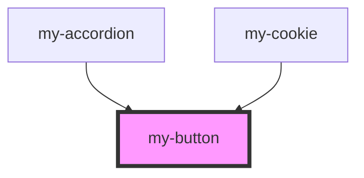

# my-button

<!-- Auto Generated Below -->

## Properties

| Property  | Attribute  | Description | Type     | Default     |
| --------- | ---------- | ----------- | -------- | ----------- |
| `quesOpt` | `ques-opt` |             | `string` | `undefined` |

## Dependencies

### Used by

 - [my-accordion](../my-accordion)
 - [my-cookie](../my-cookie)

### Graph

----------------------------------------------

*Built with [StencilJS](https://stenciljs.com/)*
