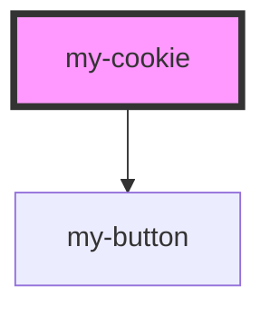

# my-cookie

<!-- Auto Generated Below -->

## Properties

| Property | Attribute | Description | Type      | Default     |
| -------- | --------- | ----------- | --------- | ----------- |
| `check`  | `check`   |             | `boolean` | `undefined` |
| `isopen` | `isopen`  |             | `boolean` | `undefined` |

## Dependencies

### Depends on

- [my-button](../my-button)

### Graph

----------------------------------------------

*Built with [StencilJS](https://stenciljs.com/)*
